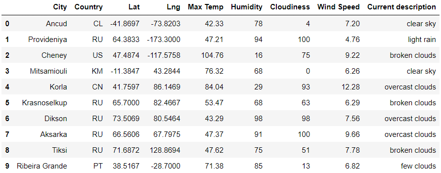
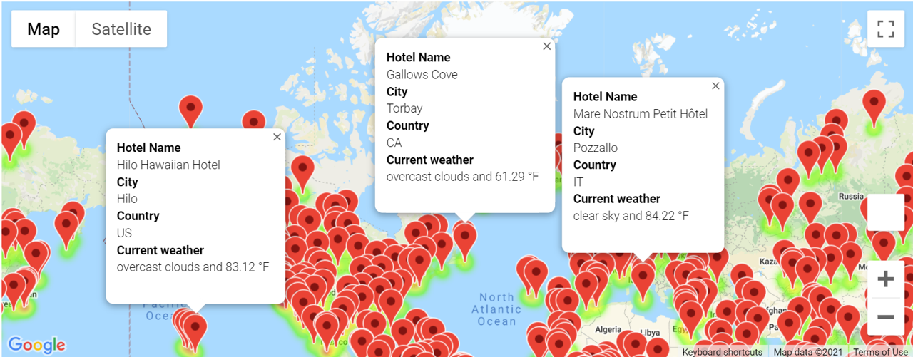

# PyWeather
gmap plots

## PlanMyTrip

The app helps to get the weather data from different cities around the world

________________________

Also the user can define the preference of weather, 

________________________________

And the app shows a map that meets this preference, around the world, and gives weather data for each city and hotel.

_________________________

## New feature 
Now the user can obtain a route map if the user wants to travel from one city to other, and get the weather data for each city and the name from the hotel

